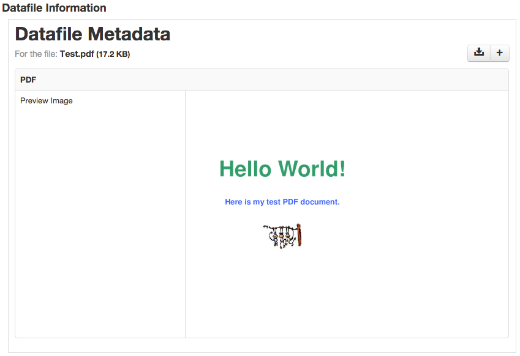

PDF Preview Image MyTardis Filter
=================================

Filter for generating image thumbnails for MyTardis using ImageMagick's convert tool.



## Requirements
 - ImageMagick (http://www.imagemagick.org/script/command-line-tools.php)
 - [MyTardis 3.6](https://github.com/mytardis/mytardis/branches/3.6)

## Installation

 - Install ImageMagick, using ```sudo apt-get install imagemagick```

Git clone this repository into `/path/to/mytardis/tardis/tardis_portal/filters`:
    
    git clone git@github.com:wettenhj/pdf-mytardis-filter.git pdf

Add the following to your MyTardis settings file eg. `/path/to/mytardis/tardis/settings.py`

```
MIDDLEWARE_CLASSES = MIDDLEWARE_CLASSES + ('tardis.tardis_portal.filters.FilterInitMiddleware',)

FILTER_MIDDLEWARE = (("tardis.tardis_portal.filters", "FilterInitMiddleware"),)
```

The above enables the filter middleware for all actions.

Then add the definition for this filter.

```
POST_SAVE_FILTERS = [
   ("tardis.tardis_portal.filters.pdf.pdf.make_filter",
    ["PDF", "http://tardis.edu.au/schemas/pdf/1"])
   ]
```
`cd /path/to/mytardis` and load the parameter schema into the MyTardis database:

```
python mytardis.py loaddata tardis/tardis_portal/filters/pdf/pdf.json
```

Restart MyTardis.
